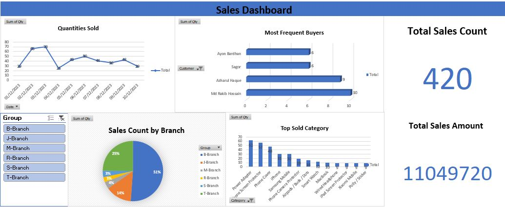

# Excel Dashboard
# Table of content:

## Sales Dashboard

# Dashboard Description
This Sales Dashboard visually presents key sales metrics and insights, focusing on quantities sold, sales distribution across branches, top buyers, and product performance. It is organized with the following sections:
- Quantities Sold (Line Chart): This section tracks the total quantities sold over time, allowing users to see trends and fluctuations in sales volume.
- Most Frequent Buyers (Bar Chart): This chart highlights the top buyers by the number of purchases, helping identify the most active customers and potential loyal clients.
- Sales Count by Branch (Pie Chart): The pie chart shows the percentage distribution of sales counts across various branches, providing insights into branch performance.
- Top Sold Category (Bar Chart): This section lists the top-selling product categories, helping understand which products contribute the most to sales.
- Total Sales Count and Sales Amount (Key Metrics): The dashboard prominently displays the total number of sales and the total sales amount, giving a quick overview of overal performance.

# Features
- Interactive Filters: Users can filter data by Group and Date, making it easy to drill down into specific time periods or branch details.
- Visual Representation: Different chart types (line, pie, and bar) allow users to quickly grasp key insights at a glance.
- Clear Metrics: Key metrics like "Total Sales Count" and "Total Sales Amount" are highlighted for a quick snapshot of overall sales performance.
# Key Features
-Real-Time Data Insights: The dashboard updates dynamically based on the latest sales data.
-Interactive Filtering: Users can filter data by date range or specific categories for detailed analysis.
-User-Friendly Visuals: Clear and intuitive charts make complex data easy to interpret.
-Correlations and Trends: Provides actionable insights through metrics like correlation coefficient and sales trends over time.

## Superstore Dashboard

